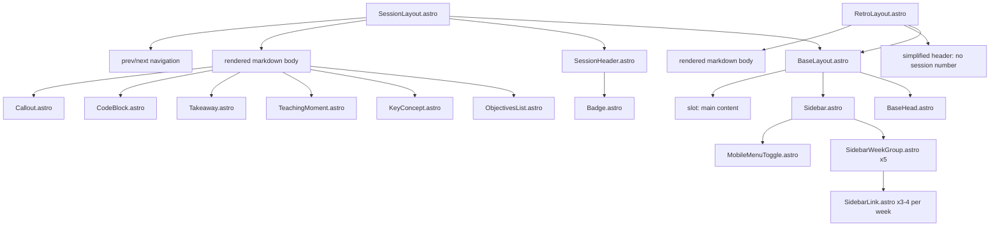
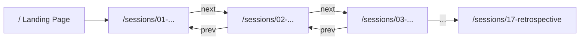
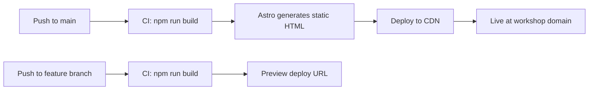

# AI/LLM Skills Coaching Workshop -- Site Architecture

**Status:** Approved
**Author:** Architect
**Date:** 2026-04-02

---

## 1. Directory Layout

```
site/
├── astro.config.mjs
├── package.json
├── tsconfig.json
├── tailwind.config.mjs
├── public/
│   ├── favicon.svg
│   ├── og-image.png
│   └── fonts/
│       ├── Inter-Variable.woff2
│       └── JetBrainsMono-Variable.woff2
├── src/
│   ├── content/
│   │   ├── config.ts                        # Zod schemas for content collections
│   │   └── sessions/
│   │       ├── 01-tokens-context-window.md
│   │       ├── 02-prompt-engineering.md
│   │       ├── 03-modes-system-prompt.md
│   │       ├── 04-model-selection.md
│   │       ├── 05-output-evaluation.md
│   │       ├── 06-basic-rules.md
│   │       ├── 07-scoped-rules.md
│   │       ├── 08-skills.md
│   │       ├── 09-agents-md.md
│   │       ├── 10-tool-use-mcp.md
│   │       ├── 11-paradigm-shift.md
│   │       ├── 12-context-engineering.md
│   │       ├── 13-architectural-constraints.md
│   │       ├── 14-garbage-collection-audit.md
│   │       ├── 15-writing-specs.md
│   │       ├── 16-project-demo.md
│   │       └── 17-retrospective.md
│   ├── components/
│   │   ├── layout/
│   │   │   ├── BaseHead.astro               # <head> meta, fonts, OG tags
│   │   │   ├── Sidebar.astro                # Left navigation shell
│   │   │   ├── SidebarWeekGroup.astro       # Collapsible week section
│   │   │   ├── SidebarLink.astro            # Individual session nav link
│   │   │   └── MobileMenuToggle.astro       # Hamburger for mobile breakpoint
│   │   ├── session/
│   │   │   ├── SessionHeader.astro          # Title, week badge, duration pill
│   │   │   ├── ObjectivesList.astro         # Learning objectives checklist
│   │   │   ├── KeyConcept.astro             # Highlighted concept callout
│   │   │   ├── TeachingMoment.astro         # Core teaching moment block
│   │   │   └── Takeaway.astro              # Session takeaway banner
│   │   └── ui/
│   │       ├── Badge.astro                  # Reusable badge (week, duration, status)
│   │       ├── Callout.astro                # Generic callout (info, warning, tip)
│   │       ├── CodeBlock.astro              # Styled code fence wrapper
│   │       └── ProgressBar.astro            # Week/course progress indicator
│   ├── layouts/
│   │   ├── BaseLayout.astro                 # HTML shell + two-column grid
│   │   ├── SessionLayout.astro              # Extends BaseLayout with session chrome
│   │   └── RetroLayout.astro                # Simplified SessionLayout for retrospective
│   ├── pages/
│   │   ├── index.astro                      # Landing page / curriculum overview
│   │   └── sessions/
│   │       └── [slug].astro                 # Dynamic route: one page per session
│   ├── styles/
│   │   ├── global.css                       # Reset, font-face, base styles
│   │   └── tokens.css                       # CSS custom properties (design tokens)
│   └── lib/
│       ├── sessions.ts                      # Helper: getSessionsByWeek(), getAdjacentSessions()
│       └── constants.ts                     # Week themes, metadata
```

### Key Design Decisions

| Decision | Rationale |
|----------|-----------|
| Astro Content Collections | Type-safe frontmatter validation via Zod; automatic slug generation; built-in markdown rendering |
| Numbered filename prefixes | Guarantees sort order matches curriculum sequence regardless of title |
| Component subdirectories | Separates layout concerns, session-specific components, and reusable UI primitives |
| `lib/` helpers | Centralizes query logic so pages and components stay declarative |
| `RetroLayout.astro` | Retrospective has no session number -- simplified variant omits session number badge, keeps week/duration chrome |

---

## 2. Component Architecture



### Component Specifications

#### `BaseLayout.astro`
- **Props:** `title: string`, `description?: string`
- **Responsibility:** HTML document shell, CSS/font loading, two-column CSS Grid
- **Grid:** `grid-template-columns: 280px 1fr` on desktop; single column on mobile

#### `Sidebar.astro`
- **Data source:** Queries all sessions from content collection, groups by `week`
- **Behavior:** Sticky positioning (`position: sticky; top: 0`), full viewport height, scrollable overflow
- **Active state:** Highlights current session link based on URL match
- **Mobile:** Hidden by default; slides in from left via `MobileMenuToggle.astro`

#### `SidebarWeekGroup.astro`
- **Props:** `week: number`, `theme: string`, `sessions: Session[]`, `currentSlug?: string`
- **Behavior:** Week header is always visible; session links shown beneath. Current week auto-expanded on mobile if using collapsible behavior
- **Visual:** Week number badge + theme text as group header

#### `SidebarLink.astro`
- **Props:** `session: Session`, `isActive: boolean`
- **Renders:** Session number circle, title text, duration pill
- **States:** default, hover, active/current

#### `SessionLayout.astro`
- **Props:** Inherits session frontmatter via content collection entry
- **Responsibility:** Session header chrome, renders `<Content />` from markdown, adds prev/next navigation footer
- **Width:** Max-width `720px` centered in the content column for optimal reading line length

#### `RetroLayout.astro`
- **Props:** `title`, `week`, `duration` (no `session` number)
- **Responsibility:** Simplified variant -- omits the circular session number badge, retains week/duration chrome and prev/next navigation

#### `SessionHeader.astro`
- **Props:** `title`, `session`, `week`, `weekTheme`, `duration`, `objectives`
- **Renders:** Session number + title as `<h1>`, week badge, duration pill, learning objectives list

#### Custom MDX Components (used inside session markdown)
- `ObjectivesList` -- styled checklist with checkmark icons
- `KeyConcept` -- blue-tinted callout box with icon
- `TeachingMoment` -- amber-tinted callout with lightbulb icon
- `Takeaway` -- green-tinted banner at the bottom of the session
- `Callout` -- generic variant with `type` prop for `info | warning | tip`

---

## 3. Session Data Model

### Content Collection Schema (`src/content/config.ts`)

```typescript
import { defineCollection, z } from 'astro:content';

const sessions = defineCollection({
  type: 'content',
  schema: z.object({
    title: z.string(),
    session: z.number().min(1).max(17).optional(), // omitted for retrospective
    week: z.number().min(1).max(5),
    weekTheme: z.string(),
    duration: z.string(),           // "30 min" | "60 min"
    objectives: z.array(z.string()),
    coreTeachingMoment: z.string(),
    takeaway: z.string(),
    status: z.enum([
      'complete',
      'in-progress',
      'planned'
    ]).default('complete'),
    order: z.number(),              // Explicit sort order (matches session number)
    isRetro: z.boolean().default(false),
  }),
});

export const collections = { sessions };
```

### Example Frontmatter (`01-tokens-context-window.md`)

```yaml
---
title: "Tokens -> Context Window"
session: 1
week: 1
weekTheme: "How LLMs Actually Work"
duration: "30 min"
order: 1
status: "complete"
objectives:
  - "Explain what a token is and how LLMs consume them"
  - "Understand that every interaction has a real dollar cost they can observe"
  - "Describe the context window as a finite shared resource that fills from the first message"
  - "Recognize what auto-compaction is, what triggers it, and what it costs"
coreTeachingMoment: >
  Learner asks one simple question inside a project and watches the token
  counter and dollar cost appear. The gap between what they expected it to
  cost and what it actually cost is the hook.
takeaway: "The mental model everything else builds on."
---

## Core Concept

Every interaction with an LLM consumes tokens...

<KeyConcept title="What is a token?">
A token is roughly 3/4 of a word...
</KeyConcept>

<TeachingMoment>
Ask one simple question inside a project and watch the token counter...
</TeachingMoment>

<Takeaway>
The mental model everything else builds on.
</Takeaway>
```

### Retrospective Frontmatter Example (`17-retrospective.md`)

```yaml
---
title: "Retrospective & Next Steps"
week: 5
weekTheme: "The Capstone Skill"
duration: "60 min"
order: 17
status: "complete"
isRetro: true
objectives:
  - "Reflect on the full arc from tokens to specs"
  - "Identify the highest-leverage next steps for continued growth"
  - "Map a path to the advanced workshop"
coreTeachingMoment: >
  Look back at the full arc and take stock of what has changed. Surface
  the highest-leverage next steps for each participant.
takeaway: "A clear picture of where you are and what to build next."
---
```

### Week Metadata Constants (`src/lib/constants.ts`)

```typescript
export const WEEKS = [
  { number: 1, theme: 'How LLMs Actually Work',     label: 'Foundations' },
  { number: 2, theme: 'Tell the Model What It Can and Cannot Do', label: 'Evaluation & Guidance' },
  { number: 3, theme: 'Making Behavior Persistent',  label: 'Thinking in Agents' },
  { number: 4, theme: 'Constraining the Agent Makes It Perform Better', label: 'Harness Engineering' },
  { number: 5, theme: 'The Capstone Skill',          label: 'Spec-Driven Development' },
] as const;
```

### Helper Functions (`src/lib/sessions.ts`)

```typescript
import { getCollection } from 'astro:content';

export async function getAllSessions() {
  const sessions = await getCollection('sessions');
  return sessions.sort((a, b) => a.data.order - b.data.order);
}

export async function getSessionsByWeek() {
  const sessions = await getAllSessions();
  const grouped = new Map<number, typeof sessions>();
  for (const session of sessions) {
    const week = session.data.week;
    if (!grouped.has(week)) grouped.set(week, []);
    grouped.get(week)!.push(session);
  }
  return grouped;
}

export async function getAdjacentSessions(currentSlug: string) {
  const all = await getAllSessions();
  const idx = all.findIndex(s => s.slug === currentSlug);
  return {
    prev: idx > 0 ? all[idx - 1] : null,
    next: idx < all.length - 1 ? all[idx + 1] : null,
  };
}
```

---

## 4. Design System

### Design Tokens (`src/styles/tokens.css`)

```css
:root {
  /* Color Palette */

  /* Primary: Deep teal -- authority, clarity, technical precision */
  --color-primary-50:  #f0fdfa;
  --color-primary-100: #ccfbf1;
  --color-primary-200: #99f6e4;
  --color-primary-300: #5eead4;
  --color-primary-400: #2dd4bf;
  --color-primary-500: #14b8a6;
  --color-primary-600: #0d9488;
  --color-primary-700: #0f766e;
  --color-primary-800: #115e59;
  --color-primary-900: #134e4a;

  /* Neutral: Cool gray -- clean, professional */
  --color-neutral-50:  #f8fafc;
  --color-neutral-100: #f1f5f9;
  --color-neutral-200: #e2e8f0;
  --color-neutral-300: #cbd5e1;
  --color-neutral-400: #94a3b8;
  --color-neutral-500: #64748b;
  --color-neutral-600: #475569;
  --color-neutral-700: #334155;
  --color-neutral-800: #1e293b;
  --color-neutral-900: #0f172a;

  /* Accent: Warm amber -- highlights, teaching moments */
  --color-accent-400: #fbbf24;
  --color-accent-500: #f59e0b;
  --color-accent-600: #d97706;

  /* Semantic */
  --color-info:    #3b82f6;  /* Blue -- key concepts */
  --color-success: #10b981;  /* Green -- takeaways */
  --color-warning: #f59e0b;  /* Amber -- teaching moments */
  --color-danger:  #ef4444;  /* Red -- warnings, failure modes */

  /* Surfaces */
  --color-bg:           #ffffff;
  --color-bg-subtle:    var(--color-neutral-50);
  --color-bg-sidebar:   var(--color-neutral-900);
  --color-text:         var(--color-neutral-800);
  --color-text-muted:   var(--color-neutral-500);
  --color-text-sidebar: var(--color-neutral-200);
  --color-border:       var(--color-neutral-200);

  /* Typography */
  --font-sans:  'Inter Variable', 'Inter', system-ui, -apple-system, sans-serif;
  --font-mono:  'JetBrains Mono Variable', 'JetBrains Mono', ui-monospace, monospace;

  --text-xs:   0.75rem;    /* 12px */
  --text-sm:   0.875rem;   /* 14px */
  --text-base: 1rem;       /* 16px */
  --text-lg:   1.125rem;   /* 18px */
  --text-xl:   1.25rem;    /* 20px */
  --text-2xl:  1.5rem;     /* 24px */
  --text-3xl:  1.875rem;   /* 30px */
  --text-4xl:  2.25rem;    /* 36px */

  --leading-tight:   1.25;
  --leading-normal:  1.6;
  --leading-relaxed: 1.75;

  --weight-normal:   400;
  --weight-medium:   500;
  --weight-semibold: 600;
  --weight-bold:     700;

  /* Spacing Scale */
  --space-1:  0.25rem;     /* 4px */
  --space-2:  0.5rem;      /* 8px */
  --space-3:  0.75rem;     /* 12px */
  --space-4:  1rem;        /* 16px */
  --space-5:  1.25rem;     /* 20px */
  --space-6:  1.5rem;      /* 24px */
  --space-8:  2rem;        /* 32px */
  --space-10: 2.5rem;      /* 40px */
  --space-12: 3rem;        /* 48px */
  --space-16: 4rem;        /* 64px */

  /* Layout */
  --sidebar-width:     280px;
  --content-max-width: 720px;
  --content-padding:   var(--space-8);

  /* Borders & Radius */
  --radius-sm:   0.25rem;
  --radius-md:   0.5rem;
  --radius-lg:   0.75rem;
  --radius-full: 9999px;
  --border-width: 1px;

  /* Shadows */
  --shadow-sm: 0 1px 2px rgba(0, 0, 0, 0.05);
  --shadow-md: 0 4px 6px -1px rgba(0, 0, 0, 0.1);
  --shadow-lg: 0 10px 15px -3px rgba(0, 0, 0, 0.1);

  /* Transitions */
  --transition-fast: 150ms ease;
  --transition-base: 200ms ease;
}
```

### Visual Identity Notes

| Element | Specification |
|---------|---------------|
| **Sidebar** | Dark background (`neutral-900`), light text, acts as persistent anchor |
| **Content area** | White background, generous whitespace, max 720px reading width |
| **Session number** | Circular badge in primary-600, white text -- appears in sidebar and session header |
| **Week header** | Uppercase label, primary-600 color, small tracking |
| **Duration pill** | Rounded badge, `neutral-100` bg, `neutral-600` text |
| **Active sidebar link** | Left border accent (`primary-400`), slightly lighter bg |
| **Callout boxes** | Left-border accent (4px), tinted background matching semantic color |
| **Code blocks** | `neutral-900` background, JetBrains Mono, syntax highlighting via Shiki (built into Astro) |
| **Headings** | `neutral-900`, semibold, tight leading |
| **Body text** | `neutral-700`, normal weight, 1.6 line height |

### Typography Scale Usage

| Context | Size | Weight |
|---------|------|--------|
| Session title (`h1`) | `text-3xl` (30px) | semibold |
| Section heading (`h2`) | `text-2xl` (24px) | semibold |
| Subsection (`h3`) | `text-xl` (20px) | medium |
| Body | `text-base` (16px) | normal |
| Sidebar week header | `text-xs` (12px) | semibold, uppercase, tracked |
| Sidebar session link | `text-sm` (14px) | medium |
| Badge / pill text | `text-xs` (12px) | medium |
| Code | `text-sm` (14px) | normal, mono |

---

## 5. Routing Strategy

### URL Structure

URLs use the numeric prefix from the filename for natural progression.

| URL | Content | Source file |
|-----|---------|-------------|
| `/` | Curriculum overview / landing | `src/pages/index.astro` |
| `/sessions/01-tokens-context-window` | Session 1 | `01-tokens-context-window.md` |
| `/sessions/02-prompt-engineering` | Session 2 | `02-prompt-engineering.md` |
| `/sessions/03-modes-system-prompt` | Session 3 | `03-modes-system-prompt.md` |
| `/sessions/04-model-selection` | Session 4 | `04-model-selection.md` |
| `/sessions/05-output-evaluation` | Session 5 | `05-output-evaluation.md` |
| `/sessions/06-basic-rules` | Session 6 | `06-basic-rules.md` |
| `/sessions/07-scoped-rules` | Session 7 | `07-scoped-rules.md` |
| `/sessions/08-skills` | Session 8 | `08-skills.md` |
| `/sessions/09-agents-md` | Session 9 | `09-agents-md.md` |
| `/sessions/10-tool-use-mcp` | Session 10 | `10-tool-use-mcp.md` |
| `/sessions/11-paradigm-shift` | Session 11 | `11-paradigm-shift.md` |
| `/sessions/12-context-engineering` | Session 12 | `12-context-engineering.md` |
| `/sessions/13-architectural-constraints` | Session 13 | `13-architectural-constraints.md` |
| `/sessions/14-garbage-collection-audit` | Session 14 | `14-garbage-collection-audit.md` |
| `/sessions/15-writing-specs` | Session 15 | `15-writing-specs.md` |
| `/sessions/16-project-demo` | Session 16 | `16-project-demo.md` |
| `/sessions/17-retrospective` | Retrospective | `17-retrospective.md` |

### Dynamic Route Implementation (`src/pages/sessions/[slug].astro`)

```astro
---
import { getCollection } from 'astro:content';
import SessionLayout from '../../layouts/SessionLayout.astro';
import RetroLayout from '../../layouts/RetroLayout.astro';
import { getAdjacentSessions } from '../../lib/sessions';

export async function getStaticPaths() {
  const sessions = await getCollection('sessions');
  return sessions.map(session => ({
    params: { slug: session.slug },
    props: { session },
  }));
}

const { session } = Astro.props;
const { Content } = await session.render();
const { prev, next } = await getAdjacentSessions(session.slug);
const Layout = session.data.isRetro ? RetroLayout : SessionLayout;
---

<Layout session={session.data} prev={prev} next={next}>
  <Content />
</Layout>
```

### Navigation Flow



Every session page has:
1. **Sidebar** -- jump to any session directly
2. **Prev/Next** -- linear navigation footer between sessions

---

## 6. Build & Deployment

### Tech Stack

| Tool | Purpose | Decision |
|------|---------|----------|
| **Astro 5.x** | Static site generator | Core framework |
| **Tailwind CSS 4.x** | Utility-first styling | Selected for development speed |
| **MDX** | Markdown + components | Selected for inline `<KeyConcept>` etc. |
| **Shiki** | Syntax highlighting | Built into Astro, zero config |

### Package Dependencies

```json
{
  "dependencies": {
    "astro": "^5.0.0",
    "@astrojs/mdx": "^4.0.0",
    "@astrojs/tailwind": "^6.0.0"
  },
  "devDependencies": {
    "tailwindcss": "^4.0.0"
  }
}
```

### Build Configuration (`astro.config.mjs`)

```javascript
import { defineConfig } from 'astro/config';
import mdx from '@astrojs/mdx';
import tailwind from '@astrojs/tailwind';

export default defineConfig({
  integrations: [mdx(), tailwind()],
  output: 'static',
  site: 'https://workshop.steppingstonelabs.com',
  markdown: {
    shikiConfig: {
      theme: 'github-dark',
      wrap: true,
    },
  },
});
```

### Deployment Options (Ranked)

1. **Netlify** (recommended) -- Zero-config Astro support, preview deploys per branch, simple DNS
2. **Vercel** -- First-class Astro adapter, fast edge CDN
3. **Cloudflare Pages** -- Free tier is generous, global edge network
4. **GitHub Pages** -- Simplest if already on GitHub, slightly more manual

### Build Pipeline



### Access Control

No authentication at launch. The live facilitation, coaching, and cohort experience are the premium value -- not the content pages themselves. Netlify password protection can be layered on later if needed.

---

## Implementation Sequence

Recommended build order:

1. **Scaffold Astro project** -- `npm create astro@latest`, add MDX + Tailwind integrations
2. **Create design tokens** -- `tokens.css` and `global.css`
3. **Build `BaseLayout` + `Sidebar`** -- Two-column grid, dark sidebar, navigation
4. **Set up content collection** -- Schema in `config.ts`, create one sample session markdown
5. **Build dynamic route** -- `[slug].astro` rendering session content
6. **Build session components** -- `SessionHeader`, `ObjectivesList`, callout components
7. **Build `RetroLayout`** -- Simplified layout variant for session 17
8. **Populate all 17 session markdown files** -- Migrate content from `SUMMARY.md`
9. **Build landing page** -- Curriculum overview grid at `/`
10. **Add prev/next navigation** -- Footer links between sessions
11. **Add mobile responsiveness** -- Hamburger menu, responsive grid
12. **Polish** -- Transitions, active states, scroll behavior, favicon
13. **Deploy** -- Connect to hosting, configure domain

---

## Resolved Decisions

| # | Question | Decision |
|---|----------|----------|
| 1 | Tailwind vs. pure CSS? | **Tailwind CSS** -- use for development speed |
| 2 | MDX custom components vs. remark plugins? | **MDX** -- `<KeyConcept>`, `<Takeaway>` etc. directly in markdown |
| 3 | Numeric prefixes in URLs? | **Yes** -- `/sessions/01-tokens-context-window` for natural progression |
| 4 | Retrospective layout? | **`RetroLayout.astro`** -- simplified variant of `SessionLayout`, omits session number badge |
| 5 | Dark mode? | **No** -- deferred; token structure supports future addition |
